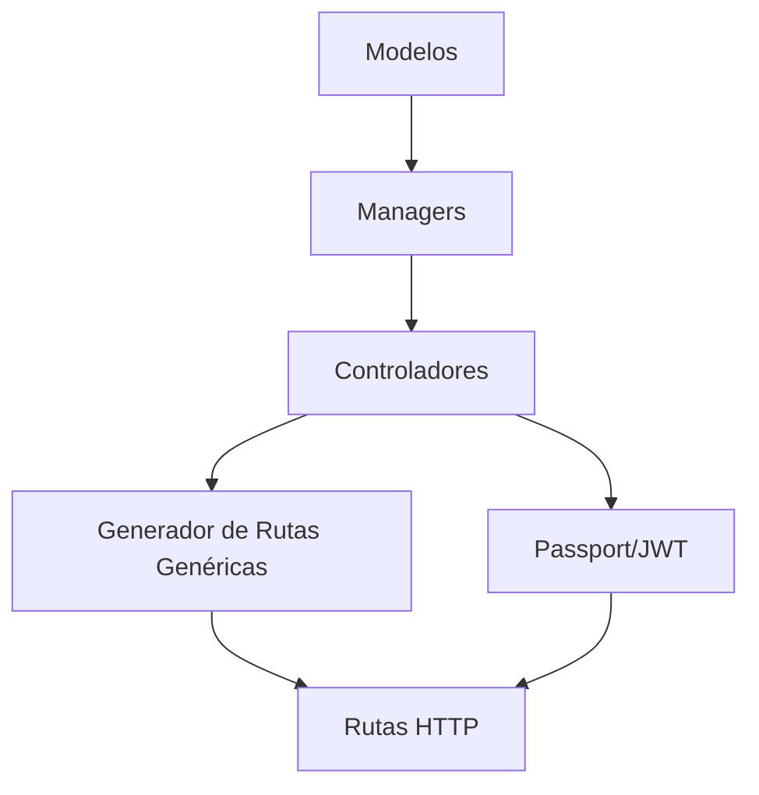

!Diagrama de código
https://gitdiagram.com/augustompantaloni/newapi
Este diagrama muestra cómo están organizados los archivos y cómo se conectan entre sí.

🚀 E-commerce API (Node.js + MongoDB)
Arquitectura limpia, escalable y con autenticación JWT

📌 Características

✅ Funcionalidades implementadas:

- CRUD completo de productos, usuarios y carritos.
- Autenticación JWT con cookies seguras (httpOnly, signed).
- Generador de rutas genéricas para evitar código repetitivo en operaciones básicas.
- Carrito automático al registrar usuario.

🔜 Futuras implementaciones:

- Vaciar carrito.
- Eliminar producto específico del carrito.
- Validaciones extras basicas.

🏗 Arquitectura

- Models (Product, User, Cart):
Definiciones de esquemas en Mongoose.

- Managers:
Lógica de negocio (ej: CartManager.createCart()).

- Controllers:
Adaptan managers a respuestas HTTP.

- GenericRouter:
Genera rutas CRUD automáticas para modelos simples.

- Auth:
Passport.js + JWT para autenticación

📄 Endpoints
🔐 Autenticación
Método	 Ruta	                   Descripción
POST	 /auth/register	Registro   (crea usuario + carrito automático).
POST	 /auth/login	Login      (devuelve token en cookie).

🛒 Carritos (Ejemplo de endpoints no genéricos)
Método	  Ruta	                     Descripción	                Estado
POST	  /api/carts/:cid/products	Agregar producto al carrito.	🔜 Pendiente
DELETE	  /api/carts/:cid	        Vaciar carrito.	                🔜 Pendiente

🛍 Productos/Usuarios (Rutas generadas por GenericRouter)
GET    /api/products
POST   /api/products
PUT    /api/products/:pid
DELETE /api/products/:pid

🛠 Tecnologías
- Backend: Node.js, Express, Mongoose.
- Autenticación: Passport.js, JWT, cookies firmadas.
- DB: MongoDB.
- Patrones: Arquitectura por capas, DRY (Don't Repeat Yourself).

🛠 Instalación
📋 Requisitos Previos
- Node.js (v18 o superior) → Descargar
- MongoDB (local o Atlas) → Guía de instalación
- Git (opcional, pero recomendado)

🔧 Pasos para Configurar el Proyecto
- Clonar el repositorio :
    git clone https://github.com/AugustoMPantaloni/APIecommerce
    cd nombreDeTuCarpeta

- Instalar dependencias:
        npm install

- Configurar variables de entorno:
Crea un archivo .env en la raíz del proyecto basado en el ejemplo (.env.example):
    cp .env.example .env

- Edita .env con tus credenciales:
# MongoDB (local o Atlas)
    MONGO_URI=mongodb://localhost:27017/nombre_db
# Autenticación JWT
    JWT_SECRET=tu_clave_secreta_jwt
    COOKIE_SECRET=clave_secreta_cookies
# Opcional: Configuración de puerto
    PORT=8080

- Iniciar el servidor:
    npm run dev  # Modo desarrollo (con nodemon)
# o
    npm start    # Modo producción

- ¡Listo! La API estará corriendo en:
    http://localhost:8080  # (o el puerto que hayas configurado)

🔍 Verificación
- Prueba los endpoints básicos:
    curl http://localhost:8080/api/products  # Debería devolver un listado de productos (o un array vacío si no hay datos).

⚠️ **Atención**  
Antes de ejecutar el proyecto, asegúrate de:  
- Tener un archivo `.env` válido en la raíz.  
- Haber reemplazado TODOS los valores de ejemplo (ej: `your_password`) por tus credenciales reales.  

📜 Scripts Disponibles
Estos son los comandos definidos en package.json para gestionar la API:

    Comando	     Descripción	                                                                 Ejecución

    npm start	 Inicia el servidor en modo producción (usando Node.js).	                     node src/server.js
    npm run dev	 Inicia el servidor en modo desarrollo (con nodemon para reinicio automático).	 nodemon src/server.js
    npm test	 ⚠️ Pendiente: Ejecuta tests (aún no implementados).	                        (Proximamente)

## Colecciones de Postman

Para facilitar las pruebas de la API, se incluyen colecciones de Postman listas para importar.

### Cómo importar la colección

1. Descargar la colección desde la carpeta `postman` en este repositorio.
2. Abrir Postman.
3. Hacer clic en el botón **Import** en la parte superior izquierda.
4. Seleccionar el archivo `.json` de la colección descargada.
5. ¡Listo! Podrás probar todas las rutas con su configuración ya lista.

---

